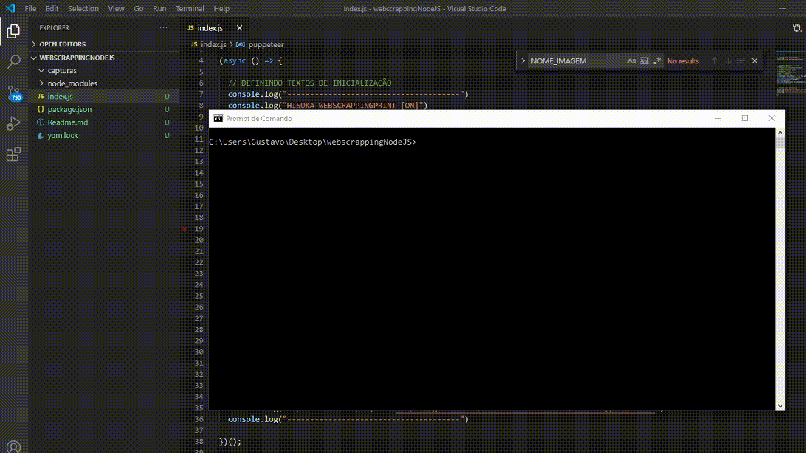

# HISOKA SCREENSHOT WEBSCRAPPING

Neste repositório, trago o código fonte de um software capaz de fazer uma screenshot do site usando webscrapping de maneira oculta usando a lib puppeteer.O objetivo deste repositório é ajudar a comunidade a se desenvolver , além de manter afiada minhas habilidades desenvolvendo usando a linguagem JavaScript usando NodeJS.

## Versões

**11/08/2020**

- [x] Captura de screenshot do site de maneira oculta de acordo com a url.
- [x] Nome dinamico , com suporte para alteração de extensão e nome também.

## Ideias para possiveis atualizacoes 

- [ ] Criar um While para monitoramento de site.
- [ ] Armazenar fotos em nuvem.

## Como usar

- Após clonar o repositório, use o seguinte comando: $ npm install .
- Para rodar o script, defina o site para ser tirada a screenshot no script e de o comando $ node index.js .

## Documentacao e explicacao da versao atual:
[Artigo Linkedin](#)

